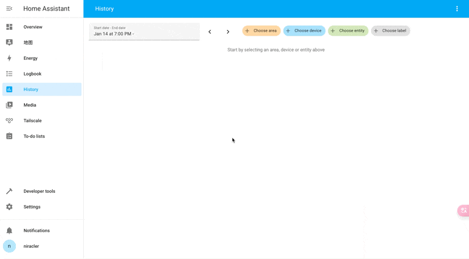
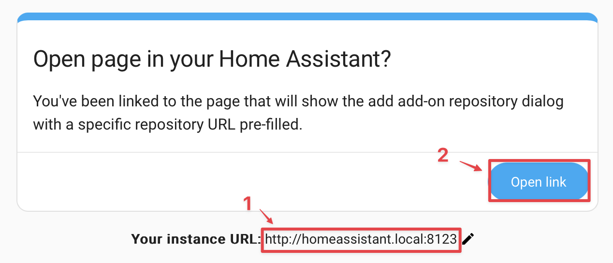
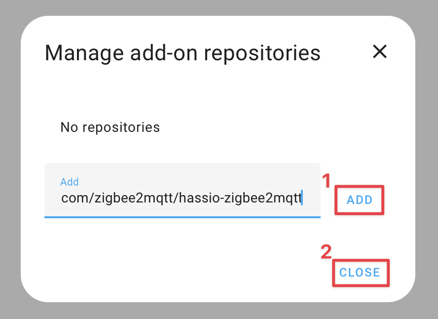
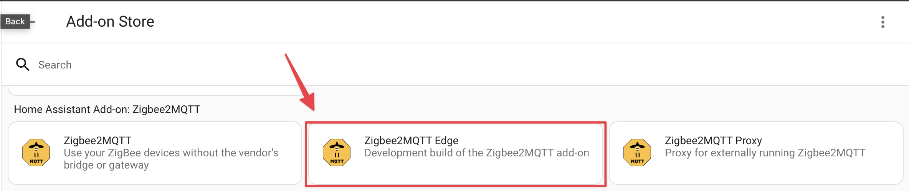
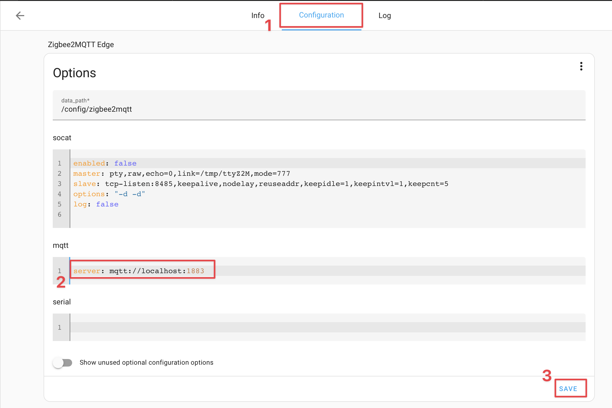
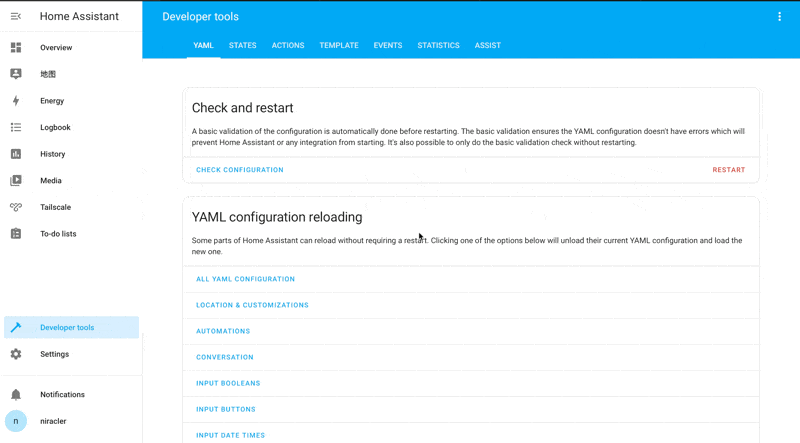
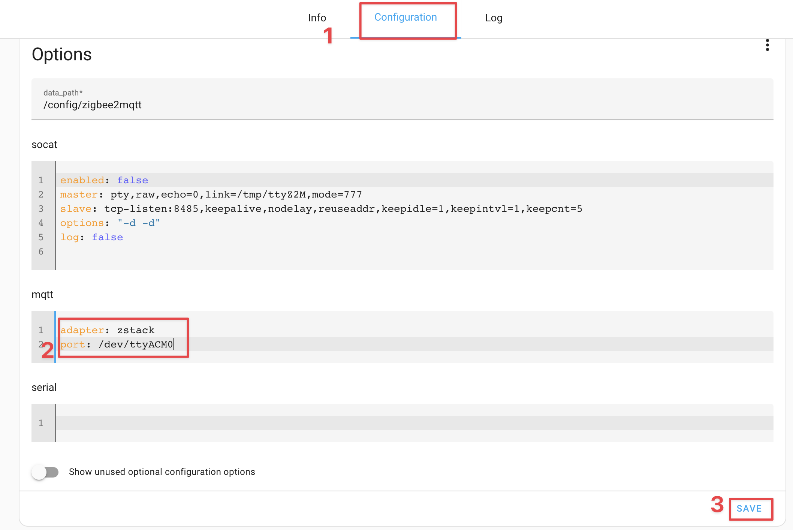
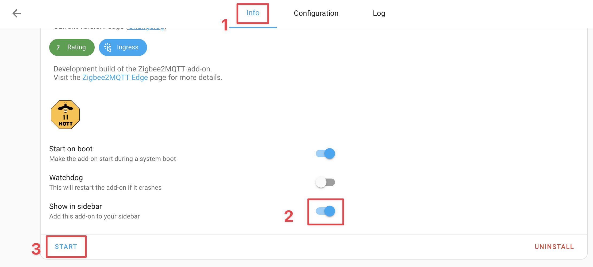
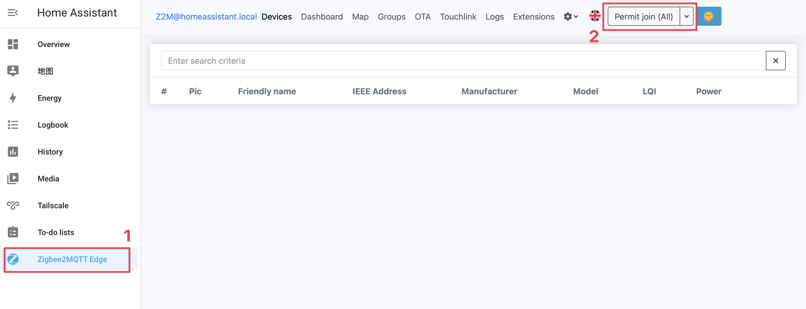

# Home Assistant Zigbee2MQTT Edge Setup Guide

## Prerequisites

- **Home Assistant**: You need a Home Assistant OS or Supervised version. (On other versions, the [add-ons feature may not be available](https://www.home-assistant.io/installation/#advanced-installation-methods), so you won't be able to install the Zigbee2MQTT addon.)

- **Zigbee USB adapter**: You need a Zigbee USB adapter. (If you don't have one, you can purchase one from the market.)

## Install MQTT broker on Home Assistant

If you don't have an MQTT broker yet; in Home Assistant go to Settings → Add-ons → Add-on store and install the Mosquitto broker add-on, then start it.



## Install Zigbee2MQTT Edge for Home Assistant

1. Click the Add repository button below to add the Zigbee2MQTT repository:

    [](https://my.home-assistant.io/redirect/supervisor_add_addon_repository/?repository_url=https%3A%2F%2Fgithub.com%2Fzigbee2mqtt%2Fhassio-zigbee2mqtt)

    (You might need to enter the internal IP address of your Home Assistant instance first)
    

2. Click Add → Close
    

3. In the add-on store, you'll see two versions of Zigbee2MQTT:
   - **Zigbee2MQTT**: The stable release (recommended for most users)
   - **Zigbee2MQTT Edge**: Tracks the `dev` branch with latest features and fixes

4. Select "Zigbee2MQTT Edge" and click Install. Wait until the installation completes.
    > **Note**: Zigbee2MQTT Edge tracks the dev branch of Zigbee2MQTT, providing access to the latest features and fixes before they are officially released. While this version offers cutting-edge functionality, it may be less stable than the regular release.

    

## Configure Zigbee2MQTT Edge

### MQTT Configuration

If you're using the Mosquitto broker add-on, set the MQTT server configuration:

```yaml
server: mqtt://localhost:1883
```



### USB Adapter Configuration

1. Find your Zigbee USB adapter path in Home Assistant:
   Go to Settings → System → Hardware → All Hardware

    

2. Configure the adapter settings (example using `/dev/ttyACM0`):

    ```yaml
    adapter: zstack
    port: /dev/ttyACM0
    ```

    

3. Start the Zigbee2MQTT Edge add-on

    

## Join device to Zigbee2MQTT

After the Zigbee2MQTT Edge add-on is started, you can join devices through the web interface:



## Troubleshooting

If the add-on fails to start with a "USB adapter discovery error", you'll need to manually specify the correct port:

- Try `/dev/ttyUSB0` or `/dev/ttyAMA0` if you have only one USB device connected
- Use the Home Assistant CLI command `ha hardware info` to identify the correct port

## Read More

- [Zigbee2MQTT Hassio Addon](https://github.com/zigbee2mqtt/hassio-zigbee2mqtt?tab=readme-ov-file#installation)
- [Install Zigbee2MQTT, Setup in 10 Minutes - YouTube](https://www.youtube.com/watch?v=sfsZF0R0HtE)
